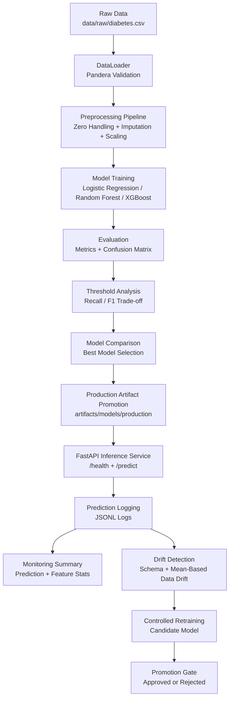

# Production-Grade Diabetes Risk Prediction MLOps Platform

## Short Summary

This project is an end-to-end MLOps portfolio platform for binary diabetes risk prediction.
The system includes:

- Binary classification for diabetes risk prediction
- Data loading and Pandera-based validation
- Domain-aware preprocessing
- Model training, evaluation, and comparison
- Threshold optimization for classification decisions
- Local MLflow experiment tracking
- Best model promotion into production artifacts
- FastAPI inference service
- Dockerized API serving
- GitHub Actions CI quality gates
- Offline SHAP explainability
- JSONL prediction logging
- Basic monitoring summary reports
- Basic schema and statistical drift detection
- Controlled retraining with a promotion gate

This is a local plus Docker plus CI supported MLOps project designed for learning, demonstration, and portfolio use. It is not a cloud-hosted enterprise platform and it is not intended for clinical deployment.

## Problem Statement

The goal is to predict diabetes risk from a tabular medical-style dataset using features such as glucose, BMI, age, insulin, and blood pressure. The target column is `Outcome`, which represents the binary classification label.

The project is intentionally designed as a production-ready ML workflow rather than a single experimental notebook. In a healthcare-style risk prediction context, relying only on accuracy is not enough. False negatives matter because a high-risk patient incorrectly classified as low-risk could be missed by downstream intervention workflows. For that reason, this project tracks recall, false negatives, F1, ROC-AUC, and confusion matrix outputs.

Important limitation: this project is educational and portfolio-focused. It does not provide medical advice, it has not been clinically validated, and it should not be used as a real clinical decision system.

## MLOps Goals

The project is structured around practical MLOps goals:

- Reproducible training through fixed data paths, deterministic splitting, lockfile-based dependencies, and pipeline runners
- Validated data input using schema checks before training begins
- Modular preprocessing with reusable sklearn-compatible transformers
- Automated evaluation with multiple classification metrics
- Threshold selection instead of blindly relying on the default `0.5` decision threshold
- Model comparison across different model families
- Artifact promotion into a stable production model directory
- API-based serving with request and response validation
- Containerization for reproducible runtime behavior
- CI quality gates for linting, typing, tests, and Docker build validation
- Offline explainability for model interpretation
- Prediction logging as a foundation for monitoring
- Monitoring and drift reports from production-style prediction logs
- Controlled retraining with a promotion gate before production overwrite

## Architecture Overview



## Project Structure

```text
.
├── data/
│   └── raw/
├── configs/
├── src/
│   ├── data_access/
│   ├── preprocessing/
│   ├── models/
│   ├── training/
│   ├── evaluation/
│   ├── tracking/
│   ├── inference/
│   ├── api/
│   ├── explainability/
│   ├── monitoring/
│   ├── retraining/
│   └── pipelines/
├── artifacts/
├── logs/
├── tests/
├── .github/workflows/
├── Dockerfile
├── pyproject.toml
└── uv.lock
```

Key directories:

- `data/`: local datasets. The raw diabetes CSV is read from `data/raw/diabetes.csv`.
- `configs/`: project configuration directory.
- `src/data_access/`: data loading, validation, and data-related exceptions.
- `src/preprocessing/`: feature constants, sklearn pipelines, column transformers, domain-specific transformers, and train/test splitting.
- `src/models/`: model factory for supported model families.
- `src/training/`: model training, artifact writing, and model promotion utilities.
- `src/evaluation/`: metrics, reports, threshold analysis, threshold selection, and model selection logic.
- `src/tracking/`: local MLflow experiment tracking.
- `src/inference/`: production artifact loading and prediction logic.
- `src/api/`: FastAPI application, schemas, dependencies, and routes.
- `src/explainability/`: offline SHAP analysis and report writing.
- `src/monitoring/`: prediction logging, log reading, monitoring summaries, drift detection, and report writing.
- `src/retraining/`: controlled retraining report structures and promotion gate logic.
- `src/pipelines/`: runnable pipeline entrypoints.
- `artifacts/`: generated model artifacts, metrics, and reports.
- `tests/`: unit tests.
- `.github/workflows/`: GitHub Actions CI workflow.

## Dataset and Data Validation

The project uses a Pima-style diabetes dataset with the target column:

- `Outcome`

Input features:

- `Pregnancies`
- `Glucose`
- `BloodPressure`
- `SkinThickness`
- `Insulin`
- `BMI`
- `DiabetesPedigreeFunction`
- `Age`

Pandera is used for runtime data validation because ML pipelines need explicit data contracts. It helps verify that expected columns exist, types are valid, and malformed data is caught at the beginning of the workflow instead of failing silently during training or evaluation.

Custom exceptions are used to make failure modes easier to read, test, and debug. For example, missing files, unsupported extensions, empty datasets, and validation errors can be handled as distinct pipeline failures.

## Domain-Aware Preprocessing

Several columns can contain `0` values that are physiologically invalid for this dataset:

- `Glucose`
- `BloodPressure`
- `SkinThickness`
- `Insulin`
- `BMI`

These zeros are treated as missing values. `Pregnancies = 0` is not treated as missing because it is a valid value.

The project includes a custom `ZeroValueToNaNTransformer` to encode this domain rule inside a reusable sklearn-compatible preprocessing pipeline.

Preprocessing choices:

- Median imputation is used because tabular medical-style data can contain outliers, and the median is more robust than the mean.
- `StandardScaler` is used because models such as logistic regression are sensitive to feature scale.
- `ColumnTransformer` and sklearn `Pipeline` are used so preprocessing is serializable, testable, and consistent between training and inference.

## Model Training

The project supports multiple model families:

- Logistic Regression as a simple, interpretable baseline
- Random Forest as a non-linear tree-based model
- XGBoost as a stronger gradient boosting model

Multiple models are trained and compared so model selection is evidence-based rather than based on a single default algorithm. This also demonstrates a common ML engineering pattern: start with a baseline, compare against more expressive models, and promote only when metrics justify it.

The training pipeline is modular because each stage can be tested and reused independently: loading, validation, splitting, preprocessing, training, evaluation, threshold analysis, artifact writing, and tracking.

## Evaluation Strategy

Accuracy alone is not sufficient for diabetes risk prediction. A model can achieve acceptable accuracy while still missing too many high-risk cases.

The project reports:

- Accuracy: overall correctness
- Precision: how many predicted positives were actually positive
- Recall: how many true positives were captured
- F1: balance between precision and recall
- ROC-AUC: ranking quality across thresholds
- Confusion matrix: explicit false positive and false negative counts

False negatives are especially important in this healthcare-style context because they represent high-risk cases predicted as low-risk.

Threshold optimization is included because the default `0.5` classification threshold is not always optimal. The project evaluates multiple thresholds and selects a threshold using the configured strategy, allowing recall/F1 trade-offs to be managed explicitly.

## MLflow Tracking

MLflow is included for local experiment tracking.

It is used to improve:

- Experiment visibility
- Parameter and metric tracking
- Artifact traceability
- Model comparison auditability

This project uses local MLflow tracking. It does not use a remote MLflow registry or managed model registry service.

## Model Comparison and Promotion

Models are not only trained, they are compared. The model comparison runner evaluates candidate model families and selects the best model using this priority:

1. Minimize selected false negatives
2. Maximize selected recall
3. Maximize selected F1
4. Maximize selected precision
5. Maximize selected ROC-AUC

Production artifacts are stored separately:

```text
artifacts/models/production/
├── model.joblib
├── preprocessing_pipeline.joblib
└── model_metadata.json
```

This separation matters because the API should serve stable production artifacts, not arbitrary training outputs. Training can produce many experimental artifacts, while serving should load from one well-defined production location.

Note: the existing model comparison runner promotes the selected best model into the production artifact folder by design. The controlled retraining runner introduced later is more conservative and does not overwrite production artifacts by default.

## FastAPI Inference Service

FastAPI is used because it is lightweight, modern, typed, and integrates well with Pydantic request validation.

Endpoints:

- `GET /health`
- `POST /predict`

The API loads the production model artifacts through the inference pipeline. The prediction pipeline dependency is cached with `lru_cache(maxsize=1)`, so the model is not loaded on every request. This is important because repeated artifact loading would add avoidable latency and file I/O overhead.

### Health Check

```bash
curl http://127.0.0.1:8000/health
```

Expected response:

```json
{
  "status": "ok"
}
```

### Prediction Request

```bash
curl -X POST http://127.0.0.1:8000/predict \
  -H "Content-Type: application/json" \
  -d '{
    "Pregnancies": 2,
    "Glucose": 120,
    "BloodPressure": 70,
    "SkinThickness": 20,
    "Insulin": 85,
    "BMI": 28.5,
    "DiabetesPedigreeFunction": 0.5,
    "Age": 33
  }'
```

Example response shape:

```json
{
  "risk_probability": 0.1787,
  "prediction": 0,
  "threshold": 0.3,
  "model_name": "xgboost"
}
```

## Dockerization

Docker is included to make API serving reproducible across machines.

Why Docker matters:

- Reduces local environment differences
- Provides a predictable runtime
- Makes the service easier to test as a deployable unit
- Validates that production artifacts can be served outside the local virtual environment

The Docker image uses:

- `python:3.12-slim` as a smaller production-oriented Python base image
- `uv` for fast dependency installation and lockfile reproducibility
- `uv sync --frozen --no-dev --no-install-project` so runtime builds use locked production dependencies
- `libgomp1` because XGBoost may require the OpenMP runtime in Linux containers

Development dependencies such as test and analysis tools are not installed into the runtime image.

## GitHub Actions CI

The CI workflow runs on:

- `push`
- `pull_request`

It performs:

```bash
uv sync --frozen
uv run ruff check .
uv run mypy src tests
uv run pytest
docker build -t diabetes-risk-api:ci .
```

Why this matters:

- Validates the project in a clean environment
- Enforces linting and import hygiene
- Runs static type checks
- Runs the test suite
- Builds the Docker image as a smoke test
- Reduces the risk of "works on my machine" failures

This project includes CI. It does not include full cloud CD, registry publishing, or production deployment automation.

## SHAP Explainability

SHAP explainability is implemented as an offline analysis pipeline.

Why SHAP was added:

- Improves model interpretability
- Produces global feature importance
- Helps inspect which transformed features contribute most to model behavior
- Adds explainability awareness, which is especially important for healthcare-style risk models


Current offline SHAP output is written to:

```text
artifacts/reports/explainability/shap_feature_importance.json
artifacts/reports/explainability/shap_summary.png
```

Example top features from the generated SHAP artifact:

| Rank | Feature | Mean Absolute SHAP Value |
|---:|---|---:|
| 1 | `numerical__Glucose` | 1.1268 |
| 2 | `numerical__BMI` | 0.5072 |
| 3 | `numerical__DiabetesPedigreeFunction` | 0.3673 |
| 4 | `numerical__Age` | 0.3599 |

SHAP values are not percentages. The report uses mean absolute SHAP values to rank global feature importance.

## Prediction Logging

Every successful `/predict` request is logged as JSONL:

```text
logs/predictions/prediction_logs.jsonl
```

Logged fields:

- `timestamp`
- `model_name`
- `risk_probability`
- `prediction`
- `threshold`
- `input_features`

JSONL was chosen because it is:

- Append-friendly
- Human-readable
- Easy to process line by line
- Suitable as a lightweight monitoring foundation before adding a database or streaming system

Prediction logs are generated runtime data and should not be committed.

## Monitoring Summary

The monitoring summary pipeline reads prediction logs and writes:

```text
artifacts/reports/monitoring/prediction_monitoring_summary.json
```

The summary includes:

- Total prediction count
- Prediction distribution
- Risk probability mean/min/max
- Model distribution
- Input feature mean/min/max

This is the first monitoring layer. It provides useful operational visibility without introducing Grafana, Prometheus, or a database too early.

## Drift Detection

The drift detection pipeline compares:

- Reference data: `data/raw/diabetes.csv`
- Current data: `input_features` from `logs/predictions/prediction_logs.jsonl`

It produces:

```text
artifacts/reports/drift/drift_report.json
```

Schema drift checks:

- `missing_features`
- `unexpected_features`
- `schema_drift_detected`

Basic data drift checks:

- Reference mean
- Current mean
- Absolute difference
- Relative difference
- Default drift threshold: `0.2`

This is intentionally basic drift detection. It is useful as a lightweight first layer, but it is not a full statistical drift platform. Future improvements could include PSI, KS tests, population segmentation, Evidently AI, alerting, or dashboard integration.

## Controlled Retraining and Promotion Gate

Controlled retraining is designed to avoid blindly overwriting the production model.

The runner:

1. Trains a new candidate model
2. Writes candidate artifacts to `artifacts/models/candidates/latest/`
3. Evaluates the current production model on the same holdout split
4. Compares candidate and production metrics
5. Writes a retraining report
6. Does not overwrite production artifacts by default

Promotion gate checks:

- Candidate recall >= production recall
- Candidate F1 >= production F1
- Candidate ROC-AUC >= production ROC-AUC - `0.02`
- Candidate false negatives <= production false negatives

If all checks pass:

```text
promotion_decision = "approved"
```

Otherwise:

```text
promotion_decision = "rejected"
```

The report is written to:

```text
artifacts/reports/retraining/retraining_report.json
```

This safer workflow reduces model regression risk, improves auditability, and separates candidate training from production promotion.

## How to Run

### Install Dependencies

This project uses `uv` and a checked-in lockfile.

```bash
uv sync --frozen
```

For local development, this installs the default and dev dependency groups used by tests, linting, typing, and offline analysis.

### Run Quality Checks

```bash
uv run ruff check .
uv run mypy src tests
uv run pytest
```

### Run the Basic Training Pipeline

```bash
uv run python -m src.pipelines.run_training_pipeline
```

### Run Model Comparison

```bash
uv run python -m src.pipelines.run_model_comparison
```

Important: this existing runner promotes the selected best model into `artifacts/models/production/`.

### Run FastAPI Locally

```bash
uv run uvicorn src.api.main:app --reload
```

Then call:

```bash
curl http://127.0.0.1:8000/health
```

### Build and Run Docker Image

```bash
docker build -t diabetes-risk-api:local .
docker run --rm -p 8000:8000 diabetes-risk-api:local
```

Then call:

```bash
curl http://127.0.0.1:8000/health
```

### Run SHAP Analysis

```bash
uv run python -m src.pipelines.run_shap_analysis
```

### Run Monitoring Summary

```bash
uv run python -m src.pipelines.run_monitoring_summary
```

### Run Drift Detection

```bash
uv run python -m src.pipelines.run_drift_detection
```

### Run Controlled Retraining

```bash
uv run python -m src.pipelines.run_controlled_retraining
```

This writes candidate artifacts and a retraining report. It does not overwrite production artifacts by default.

## Example API Request and Response

Request:

```bash
curl -X POST http://127.0.0.1:8000/predict \
  -H "Content-Type: application/json" \
  -d '{
    "Pregnancies": 2,
    "Glucose": 120,
    "BloodPressure": 70,
    "SkinThickness": 20,
    "Insulin": 85,
    "BMI": 28.5,
    "DiabetesPedigreeFunction": 0.5,
    "Age": 33
  }'
```

Response shape:

```json
{
  "risk_probability": 0.1787,
  "prediction": 0,
  "threshold": 0.3,
  "model_name": "xgboost"
}
```

## Generated Artifacts

Important generated paths:

```text
artifacts/models/production/
artifacts/models/candidates/latest/
artifacts/reports/explainability/
artifacts/reports/monitoring/
artifacts/reports/drift/
artifacts/reports/retraining/
logs/predictions/prediction_logs.jsonl
mlruns/
mlflow.db
```

Production model artifacts are required for the API to serve predictions:

```text
artifacts/models/production/model.joblib
artifacts/models/production/preprocessing_pipeline.joblib
artifacts/models/production/model_metadata.json
```

Reports, logs, candidate models, MLflow runtime files, and generated monitoring outputs are runtime artifacts. They are useful for local inspection, but they should be treated as generated outputs rather than source code.

## Testing Strategy

The project includes unit and API tests across the ML lifecycle:

- Data loading and validation
- Preprocessing transformers and pipelines
- Model factory
- Training pipeline
- Evaluation metrics and reports
- Threshold analysis and selection
- Model artifact writing and promotion
- Inference predictor
- FastAPI routes and schemas
- SHAP analyzer and report writer
- Prediction logging
- Monitoring summary
- Drift detection
- Controlled retraining promotion gate and report writer

API tests use dependency overrides so they do not need real production model artifacts. Tests that write logs or generated outputs use temporary paths such as `tmp_path`, avoiding dependence on local runtime files.

Current local test result:

```text
111 passed
```

## Design Decisions

| Decision | Choice | Why |
|---|---|---|
| Data validation | Pandera | Provides a runtime data contract so bad columns, types, and malformed data are caught early. |
| Error handling | Custom exceptions | Makes pipeline failures easier to read, test, and debug. |
| Domain preprocessing | Zero-as-missing for selected medical features | Encodes domain knowledge that `0` is invalid for glucose, blood pressure, skin thickness, insulin, and BMI. |
| Pregnancy handling | `Pregnancies = 0` remains valid | Zero pregnancies is a valid clinical-style value, not missing data. |
| Missing value strategy | Median imputation | More robust than mean imputation for skewed tabular medical-style data. |
| Scaling | `StandardScaler` | Supports scale-sensitive models such as logistic regression. |
| Preprocessing architecture | sklearn `Pipeline` and `ColumnTransformer` | Keeps training and inference preprocessing consistent, serializable, and testable. |
| Model families | Logistic Regression, Random Forest, XGBoost | Enables baseline, non-linear, and stronger boosting comparisons. |
| Evaluation | Accuracy, precision, recall, F1, ROC-AUC, confusion matrix | Captures more risk dimensions than accuracy alone, especially false negatives. |
| Threshold optimization | Threshold analysis and selected threshold artifacts | Allows decision thresholds to reflect recall/F1 trade-offs instead of assuming `0.5`. |
| Experiment tracking | Local MLflow | Tracks metrics, parameters, and artifacts without requiring a remote registry. |
| Serving artifacts | `artifacts/models/production/` | Gives the API a stable artifact location separate from experiments. |
| API framework | FastAPI | Lightweight, typed, modern, and well suited for ML inference APIs. |
| Request validation | Pydantic schemas | Rejects malformed prediction requests before inference logic runs. |
| Model loading | Cached FastAPI dependency with `lru_cache` | Avoids reloading model artifacts on every request. |
| Runtime packaging | Docker | Provides reproducible serving and validates deployability beyond the local virtual environment. |
| Dependency management | `uv` with `uv.lock` | Fast installation and lockfile-based reproducibility. |
| CI | GitHub Actions | Runs lint, type checks, tests, and Docker build validation on push and pull request. |
| Explainability | Offline SHAP | Provides interpretability without increasing API runtime latency or Docker image weight. |
| Prediction logs | JSONL files | Append-friendly, human-readable, and lightweight before introducing a database. |
| Monitoring | Summary report before dashboards | Adds operational visibility without prematurely introducing Grafana, Prometheus, or DB infrastructure. |
| Drift detection | Basic schema and mean-based relative drift | Provides a first drift layer before advanced statistical tooling. |
| Retraining | Candidate model before production promotion | Prevents automatic production overwrite during retraining. |
| Promotion safety | Promotion gate | Reduces model regression risk by requiring candidate metrics to meet production-aware criteria. |

## Limitations and Possible Extensions

This project is designed as a production-oriented MLOps portfolio project, not as a clinically validated medical system.

Current limitations:

- The dataset is small and used for educational purposes.
- The model is not clinically validated and must not be used for real medical decision-making.
- Prediction logs are locally generated; there is no real production traffic.
- The API is not deployed to a cloud environment.
- MLflow is used locally, not with a remote tracking server or model registry.
- Drift detection is intentionally basic and mean-based.
- Retraining is manually triggered rather than scheduled.

Possible extensions for a real production environment:

- Deploy the API to a cloud platform.
- Use a remote MLflow Tracking Server and Model Registry.
- Store model and data artifacts in object storage.
- Add advanced drift detection with PSI, KS tests, or Evidently AI.
- Add scheduled retraining.
- Add authentication and rate limiting.
- Add production dashboards for monitoring and drift status.

## What This Project Demonstrates

This project demonstrates practical ML engineering and MLOps skills:

- End-to-end ML workflow design
- Data validation and domain-aware preprocessing
- Modular training and evaluation pipelines
- Evidence-based model comparison
- Threshold optimization for business and domain trade-offs
- Local experiment tracking with MLflow
- Production inference API design
- Dockerized serving
- Automated CI quality gates
- Explainability and monitoring foundations
- Basic drift detection
- Safer retraining design with promotion gates

